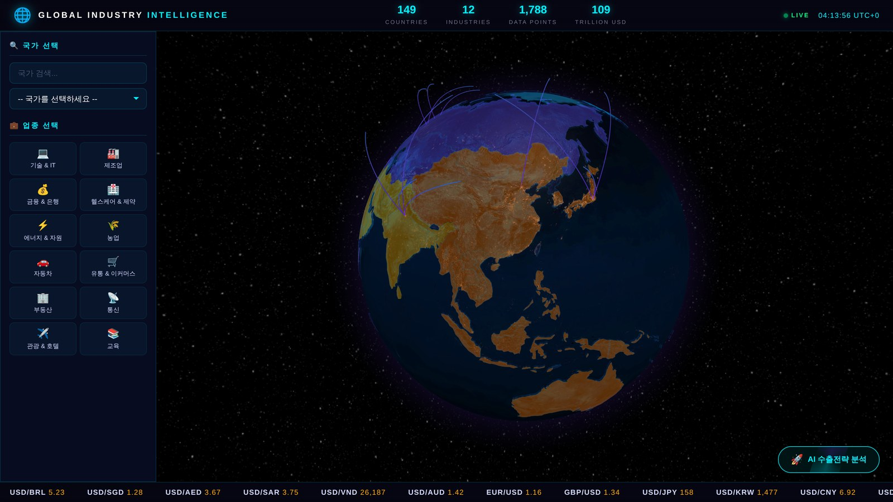
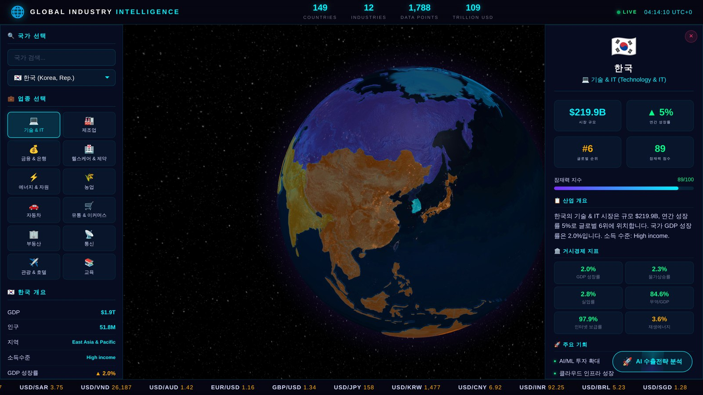
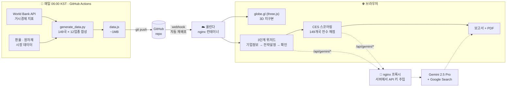
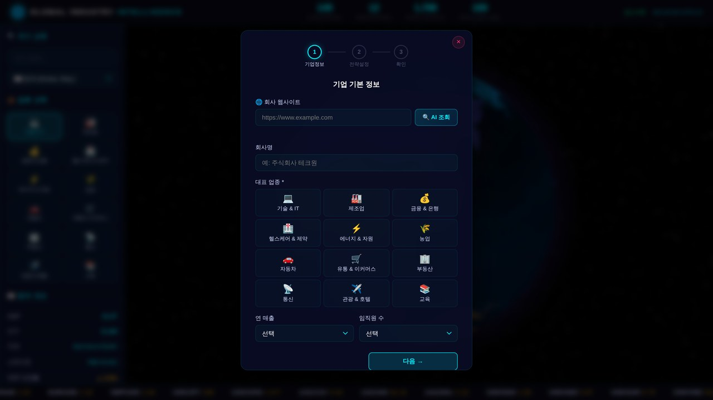

<div align="center">

# 🌍 Global Industry Intelligence

### 149개국 × 12개 산업 데이터를 3D 지구본에 올리고, AI가 우리 회사 맞춤 해외진출 전략을 써주는 대시보드

[](https://rinda-globe.rinda.ai/)
[-6f42c1?style=for-the-badge)](https://ops.rinda.ai)




</div>

---

## 이게 뭔가요?

**"우리 제품, 어느 나라에 팔아야 할까?"** 에 데이터로 답하는 웹 대시보드입니다.

수출을 고민하는 회사가 답을 얻으려면 보통 World Bank 통계를 뒤지고, 국가별 산업 리포트를 사고, 컨설팅을 받습니다. 몇 주가 걸리고 수백만 원이 듭니다. 이 프로젝트는 그 과정을 **3분짜리 무료 웹 페이지**로 압축했습니다.

회사 홈페이지 주소 하나만 넣으면 — AI가 그 회사가 뭘 하는 회사인지 알아내고, 149개국을 전부 채점해서, 상위 후보국과 그 이유를 담은 보고서를 만들어 줍니다.

| | |
|---|---|
| 🌐 **탐색** | 3D 지구본에서 국가를 고르면 GDP·인구·물가·무역의존도·인터넷 보급률 같은 거시지표와, 12개 업종별 시장규모·성장률·글로벌 순위를 즉시 확인 |
| 🤖 **AI 진단** | 회사 URL → Gemini가 Google Search로 회사를 조사해 업종·매출·임직원 수를 자동 채움 |
| 📊 **점수화** | 6개 차원으로 149개국을 전부 채점(CES). 사용자가 고른 우선순위에 따라 가중치가 실제로 바뀜 |
| 📄 **보고서** | 진출 전략 유형, 수입 동향, 경쟁 환경, 제품-시장 적합도까지 담아 PDF로 저장 |

<br>

<div align="center">

<sub><i>국가 + 업종을 고르면 시장규모·성장률·글로벌 순위·잠재력 점수와 거시경제 지표가 함께 열립니다</i></sub>
</div>

---

## 어떻게 작동하나요?



핵심은 **빌드가 없다**는 점입니다. 번들러도, 프레임워크도, `node_modules`도 없습니다. `index.html` + `app.js` + `data.js` + `styles.css` 네 개 파일이 전부이고, 데이터는 파이썬 파이프라인이 매일 새로 만들어 커밋합니다.

### CES 점수는 어떻게 나오나요?

**CES(Country Expansion Score)** 는 "이 회사가 이 나라에 진출하면 얼마나 좋은가"를 0~100으로 환산한 값입니다. 6개 차원을 각각 계산한 뒤 가중평균합니다.

| 차원 | 계산 근거 |
|---|---|
| 📦 **시장규모** | 해당 업종의 국가별 시장 규모 (로그 스케일 정규화) |
| 📈 **성장률** | 업종 성장률 70% + 국가 GDP 성장률 30% |
| 🚀 **잠재력** | 기본 잠재력 40% + 업종별 글로벌 랭킹 60% |
| 🛡️ **안정성** | GDP 성장률 − 물가상승률 − 실업률 기반 거시 안정성 70% + 산업 성숙도 30% |
| 🔓 **개방도** | 무역/GDP 비중 50% + 업종 랭킹 50% |
| 📶 **디지털** | 인터넷 보급률 70% + 업종 랭킹 30% (디지털 친화 업종은 가산) |

기본 가중치는 6개 균등(각 1/6)이고, 위저드에서 고른 우선순위 1·2·3순위에 각각 **+0.25 / +0.15 / +0.08** 이 더해진 뒤 재정규화됩니다. 그래서 "성장률"을 1순위로 고른 회사와 "안정성"을 1순위로 고른 회사는 **실제로 다른 나라를 추천받습니다.**

점수와 별개로, 회사 프로필(매출 규모·임직원 수·해외 경험)과 대상국 특성을 조합해 **진출 전략 유형**도 결정됩니다.

<table>
<tr>
<td width="25%" align="center">🌐<br/><b>수출 & 이커머스</b><br/><sub>소규모 · 해외경험 없음</sub></td>
<td width="25%" align="center">📱<br/><b>디지털 퍼스트</b><br/><sub>디지털 업종 · 인터넷 70%↑</sub></td>
<td width="25%" align="center">🤝<br/><b>현지 파트너십</b><br/><sub>개방경제 · 일부 경험</sub></td>
<td width="25%" align="center">🏢<br/><b>직접투자</b><br/><sub>대규모 · 다수 경험</sub></td>
</tr>
</table>

<br>

<div align="center">

<sub><i>회사 웹사이트 주소만 넣고 <b>AI 조회</b>를 누르면 나머지 항목이 자동으로 채워집니다</i></sub>
</div>

---

## 빠른 시작

빌드 단계가 없어서 정적 서버만 있으면 됩니다.

```bash
git clone https://github.com/FINGU-GRINDA/rinda-globe-dashboard.git
cd rinda-globe-dashboard

python3 -m http.server 8000      # → http://localhost:8000
```

> [!NOTE]
> `file://` 로 직접 열면 안 됩니다. `fetch()` 로 지구본 지형 데이터를 받아오기 때문에 반드시 HTTP 서버가 필요합니다.

### 컨테이너로 실행 (프로덕션과 동일한 환경)

```bash
docker build -t globe-dashboard .
docker run --rm -p 3000:3000 \
  -e GEMINI_API_KEY="your-key-here" \
  globe-dashboard
```

`GEMINI_API_KEY` 를 넣으면 AI 호출이 **nginx 리버스 프록시**를 타면서 키가 브라우저에 전혀 노출되지 않습니다. 안 넣어도 사이트는 정상 동작합니다(프록시가 501을 반환하면 클라이언트가 알아서 폴백).

### 데이터 다시 만들기

```bash
pip install -r requirements.txt
python scripts/run_all.py        # World Bank → 시장데이터 → data.js
```

---

## 배포

이 저장소는 **[올린다(Allrinda)](https://ops.rinda.ai)** 에 배포되어 있습니다. 등록된 브랜치에 푸시하면 GitHub 웹훅이 자동으로 재배포합니다 — 매일 도는 데이터 갱신 커밋도 포함해서요.

| 항목 | 값 |
|---|---|
| 앱 이름 | `rinda-globe-dashboard` |
| 타입 | `docker` (저장소의 Dockerfile로 빌드) |
| 포트 | `3000` |
| 헬스체크 | `https://rinda-globe.rinda.ai/healthz` → `{"status":"ok"}` |
| 도메인 | **[rinda-globe.rinda.ai](https://rinda-globe.rinda.ai/)** |
| 자동 배포 | 켜짐 |

```bash
allrinda apps create --name rinda-globe-dashboard \
  --repo FINGU-GRINDA/rinda-globe-dashboard \
  --type docker --branch main --port 3000

allrinda env push rinda-globe-dashboard --file .env   # GEMINI_API_KEY (선택)
allrinda deploy rinda-globe-dashboard --watch
```

> [!NOTE]
> 헬스체크(`healthUrl`)는 **절대 URL**이어야 합니다. `/healthz` 같은 경로만 넣으면 프로브가 돌지 않아
> 컨테이너가 멀쩡한데도 상태가 계속 `ok: false` 로 보입니다.
>
> 그리고 앱 이름은 `rinda-globe-dashboard` 지만 배정된 도메인은 `rinda-globe.rinda.ai` 입니다.
> `index.html` 의 canonical/OG 태그와 `sitemap.xml`·`robots.txt` 는 **실제 도메인** 기준으로 맞춰져 있어야
> 검색엔진이 엉뚱한 주소를 인덱싱하지 않습니다.

### 이미지가 하는 일

정적 사이트지만 그냥 파일만 얹지 않습니다.

- **콘텐츠 해시 캐시 버스팅** — 빌드할 때 `app.js` / `styles.css` / `data.js` 의 md5를 구해 `index.html` 의 `?v=` 토큰을 갈아끼웁니다. 덕분에 `immutable` 1년 캐시를 안전하게 걸 수 있고, 매일 갱신되는 `data.js` 도 **자동으로** 새 URL을 얻습니다. (사람이 버전 문자열을 손으로 올리는 걸 잊어도 안전합니다.)
- **사전 압축** — 빌드 타임에 `gzip -9` 로 미리 압축해 `gzip_static` 으로 서빙합니다. `data.js` 기준 **1,016 KB → 45 KB (95.5% 감소)**.
- **API 키 서버 보관** — `/api/gemini/*` 요청에 nginx가 서버 환경변수의 키를 붙여 Google로 넘깁니다. 키는 번들·요청라인·액세스로그 어디에도 남지 않습니다.
- **프록시 남용 방지** — 이 프록시는 인터넷에 열려 있고 **회사 Gemini 비용을 씁니다.** 그래서 모델을 앱이 실제로 쓰는 `gemini-2.5-pro` / `gemini-2.5-flash` 로만 허용하고(그 외 403), IP당 `20r/m` + burst 10 으로 제한합니다(초과 시 429). 경로 모양만 막으면 누구나 가장 비싼 모델을 우리 계정으로 호출할 수 있습니다.
- **보안 헤더** — `X-Content-Type-Options`, `X-Frame-Options`, `Referrer-Policy`, `Permissions-Policy`, `Cross-Origin-Opener-Policy`.

---

## 환경 변수

| 변수 | 필수 | 설명 |
|---|---|---|
| `GEMINI_API_KEY` | 선택(**권장**) | 설정하면 AI 호출이 서버 프록시를 경유합니다. 미설정 시 프록시는 501을 반환하고 클라이언트가 폴백 키로 직접 호출합니다. |

> [!WARNING]
> **`app.js` 에 폴백용 Gemini 키가 아직 내장되어 있습니다.** base64로 쪼개져 있지만 이건 난독화일 뿐 보호가 아닙니다 — 개발자도구를 열면 누구나 읽을 수 있고, 이미 공개 저장소 히스토리에 남아 있습니다.
>
> 서버에 `GEMINI_API_KEY` 를 설정한 뒤에는 반드시:
> 1. Google AI Studio에서 **기존 키를 폐기하고 새 키를 발급**한 다음
> 2. 새 키를 `GEMINI_API_KEY` 로만 등록하고
> 3. `app.js` 의 `GEMINI_FALLBACK_KEY_PARTS` 를 `[]` 로 비우세요.
>
> 3번만 하면 나머지는 그대로 동작합니다. 새 키가 브라우저로 나가는 일은 없습니다.

---

## 프로젝트 구조

```
rinda-globe-dashboard/
├── index.html              # 단일 진입점 — SEO/OG 메타, CSP, 레이아웃 골격
├── app.js                  # 전체 앱 로직 (~2,700줄, 의존성 없음)
│   ├── 3D 지구본           #   globe.gl 초기화, 국가 색상, 무역 항로 아크
│   ├── 데이터 패널          #   국가 × 업종 선택 → 지표 렌더링
│   ├── 위저드              #   3단계 기업 프로필 수집
│   ├── CES 스코어링         #   149개국 전수 채점 + 전략 유형 판정
│   └── Gemini 연동         #   프록시 우선 → 직접 호출 폴백, 모델 체인 재시도
├── data.js                 # 🤖 자동 생성 — 149국 × 12업종 (직접 수정 금지)
├── styles.css              # 글래스모피즘 + 네온 HUD 테마
├── robots.txt              # ⚠️ sitemap URL — 배포 도메인과 반드시 일치
├── sitemap.xml             # ⚠️ loc URL — 배포 도메인과 반드시 일치
├── requirements.txt        # 파이썬 파이프라인 의존성 (requests, beautifulsoup4)
│
├── scripts/                # 파이썬 데이터 파이프라인 (CI 전용)
│   ├── fetch_worldbank.py  #   World Bank API → 거시지표
│   ├── fetch_market.py     #   환율 · 원자재 · 지수
│   ├── generate_data.py    #   업종별 시장 추정 + data.js 생성
│   ├── run_all.py          #   위 3개를 순서대로 실행
│   └── google_apps_script.js  # 리드 수집 웹훅 (Apps Script에 별도 배포)
├── raw_data/               # 파이프라인 중간 산출물 (JSON)
│
├── Dockerfile              # 2단계 빌드 — 해시/압축 → nginx
├── nginx/
│   ├── nginx.conf          #   gzip_static, 로그 포맷
│   ├── default.conf.template  # 서버 블록 + Gemini 프록시 (envsubst)
│   ├── security-headers.conf
│   └── docker-entrypoint.d/05-resolver.sh
└── .github/workflows/daily-update.yml   # 매일 06:00 KST 데이터 갱신
```

### 기술 스택

| 영역 | 사용 기술 |
|---|---|
| 프론트엔드 | Vanilla JS (ES2020+) — 프레임워크·번들러 없음 |
| 3D 렌더링 | [globe.gl](https://github.com/vasturiano/globe.gl) 2.27 (three.js) + topojson-client |
| AI | Gemini 2.5 Pro → 2.5 Flash 폴백, Google Search 그라운딩 |
| 데이터 | World Bank Open Data, IMF, Yahoo Finance(비공식), ExchangeRate API |
| 서빙 | nginx 1.27 alpine (Docker 다단계 빌드) |
| 배포 | 올린다(Allrinda) — GitHub 웹훅 자동 배포 |

---

## 데이터에 대해

- **출처** — 거시경제 지표는 [World Bank Open Data](https://data.worldbank.org/), 주가·지수·원자재는 **Yahoo Finance 비공식 quote API**(`query1.finance.yahoo.com`), 환율은 [ExchangeRate API](https://open.er-api.com/)에서 가져옵니다. 실제 관측값입니다.
  - Yahoo 쪽은 공식 문서가 없는 비공개 엔드포인트라 예고 없이 바뀔 수 있습니다. 실패 시 파이프라인은 환율 API로 폴백합니다.
- **업종별 수치** — 국가별 12개 업종의 시장규모·성장률·잠재력·글로벌 순위는 GDP·인구·인터넷 보급률·무역의존도 등을 조합한 **모델 추정치**입니다. 실측 산업 통계가 아닙니다.
- **갱신 주기** — 매일 06:00 KST에 GitHub Actions가 파이프라인을 돌려 `data.js` 를 커밋하고, 그 푸시가 올린다 재배포를 트리거합니다.

> [!IMPORTANT]
> 이 도구가 내는 결과는 **후보국을 좁히기 위한 스크리닝**입니다. 실제 진출 의사결정에는 현지 실사, 규제 검토, 법률 자문이 반드시 필요합니다.

---

## 기여

1. 이슈로 먼저 이야기해 주세요.
2. `data.js` 는 자동 생성 파일입니다 — 고쳐야 할 게 있으면 `scripts/generate_data.py` 를 고치세요.
3. 빌드가 없으므로 `python3 -m http.server` 로 띄워 브라우저에서 바로 확인하면 됩니다.
4. `app.js` 를 수정했다면 `node --check app.js` 로 문법을, 컨테이너 변경이라면 `docker build` + `/healthz` 확인을 부탁드립니다.

---

<div align="center">
<sub>Built by <a href="https://grinda.ai">GRINDA AI</a> · 데이터 출처 World Bank Open Data</sub>
</div>
